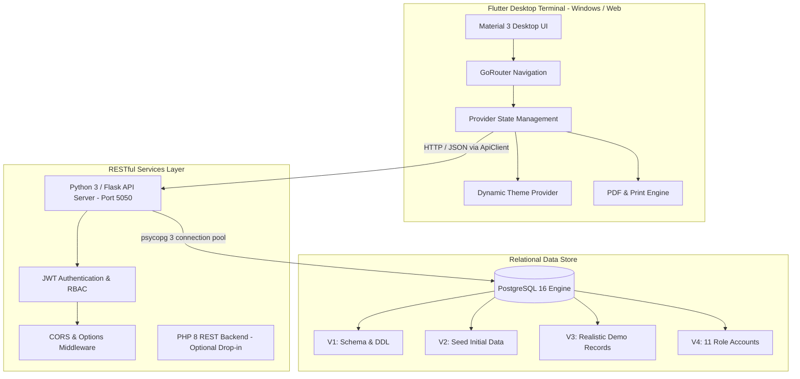

# 🎓 Oakridge School Management System (ERP Desktop)

<div align="center">


<p align="center">
  <b>An enterprise-grade, full-stack School Management ERP & Desktop Terminal designed for modern educational institutions.</b>
  <br />
  Automates student lifecycles, faculty administration, attendance metrics, grading, fee invoicing with PDF generation, library catalogs, and campus transit operations.
</p>

[Key Features](#-key-features) • [System Architecture](#-system-architecture) • [Tech Stack](#-tech-stack) • [Installation & Setup](#-installation--setup) • [Default Demo Accounts](#-default-demo-accounts) • [API Overview](#-api-overview) • [Contributing](#-contributing)

---

</div>

## 🌟 Key Features

### 👨‍🎓 1. Student Lifecycle & Admissions
- **Digital Admissions**: Multi-field admission modal covering student demographics, guardian particulars, enrollment numbers, class, and section assignments.
- **Student Directory**: High-performance searchable and filterable directory with real-time class/status filters.
- **Academic Profiles**: View historical performance, contact details, attendance rates, and fee histories.

### 👩‍🏫 2. Faculty & Staff Administration
- **Teacher Directory**: Maintain records of academic staff, assigned departments, qualifications, joined dates, and assigned subjects.
- **Workload Allocation**: Manage teaching assignments across multiple classes and courses.

### 📋 3. Attendance Tracking & Analytics
- **Daily Attendance Register**: Bulk-marking interface supporting `Present`, `Absent`, `Late`, and `Excused` statuses.
- **Section-wise Filtering**: Fast date-pickers and section selectors with quick batch submission.
- **Real-Time Attendance Rate**: Automatic calculation of institutional attendance percentages.

### 📝 4. Examinations & Gradebook
- **Exam Management**: Schedule term assessments, midterms, and final evaluations.
- **Subject-Wise Marks Entry**: Enter marks with instant validation against maximum score limits.
- **Automated GPA & Grade Computation**: Configurable grading criteria with automatic percentage and GPA calculations.

### 💳 5. Fees Management & PDF Invoicing
- **Fee Structures**: Define tuition, lab, examination, and transport fee heads.
- **Invoice Status Tracker**: Categorization into `Paid`, `Pending`, and `Overdue` invoices.
- **Vector PDF Vouchers**: Built-in PDF generator creates institutional fee vouchers and receipts with direct preview and system print spooling.

### 📚 6. Library Management
- **Book Catalog**: Track book title, author, category, ISBN, and shelf locations.
- **Inventory Ledger**: Real-time stock counts (total copies vs. available copies).
- **Issue & Return Tracking**: Monitor active loans, due dates, and return statuses.

### 🚌 7. Fleet & Transportation
- **Route & Stop Management**: Configure vehicle routes, pick-up points, and schedules.
- **Fleet Allocation**: Track vehicle registrations, driver contact details, and seating capacity.

### 📊 8. Executive Analytics Dashboard
- **KPI Metrics**: Real-time metrics for total active students, teachers, monthly revenue collection, and institutional attendance rate.
- **Visual Trends**: Revenue flow summaries, quick action triggers, and recent administrative logs.

### 🔐 9. Multi-Tier Role-Based Access Control (RBAC)
- Fine-grained permission system supporting **11 distinct user roles**:
  - `Super Admin`, `Admin`, `Principal`, `Vice Principal`, `Teacher`, `Accountant`, `Librarian`, `Transport Manager`, `Receptionist`, `Parent`, `Student`.

### 🌓 10. Material 3 Adaptive Desktop UI
- Designed specifically for large screens and desktop terminals.
- Dynamic **Dark Mode** and **Light Mode** support with smooth color token transitions.

---

## 🏗 System Architecture



---

## 🛠 Tech Stack

| Layer | Technology | Description |
|---|---|---|
| **Frontend Framework** | [Flutter](https://flutter.dev/) (SDK ^3.12) | Cross-platform desktop UI engine |
| **Programming Language** | [Dart](https://dart.dev/) | Client-side reactive business logic |
| **State Management** | [Provider](https://pub.dev/packages/provider) | Scalable state management across modules |
| **Routing** | [GoRouter](https://pub.dev/packages/go_router) | Declarative desktop routing and deep-linking |
| **Document Generation**| [pdf](https://pub.dev/packages/pdf) & [printing](https://pub.dev/packages/printing) | Native A4 and thermal receipt generation |
| **Primary Backend** | [Python 3](https://python.org/) & [Flask](https://flask.palletsprojects.com/) | High-speed REST API on port `5050` |
| **Secondary Backend** | [PHP 8](https://www.php.net/) | Alternative lightweight backend in `backend_php/` |
| **Database** | [PostgreSQL 16](https://www.postgresql.org/) | ACID-compliant enterprise relational database |
| **DB Driver** | [psycopg 3](https://www.psycopg.org/) | Fast native binary protocol PostgreSQL driver |
| **Database Migrations**| [Flyway SQL Scripts](backend/src/main/resources/db/migration) | Versioned database schema evolution (V1 to V4) |

---

## 📂 Project Structure

```text
school_managements/
├── assets/                          # Static assets and icons
│   └── images/
│       └── logo.png                 # Institutional logo
├── backend/                         # Python Flask REST API
│   ├── src/main/resources/db/migration/ # PostgreSQL SQL migration scripts
│   │   ├── V1__init_schema.sql      # Tables, relationships, and constraints
│   │   ├── V2__seed_data.sql        # Initial lookup & master tables
│   │   ├── V3__realistic_demo_records.sql # Rich dummy dataset for all modules
│   │   └── V4__seed_all_roles_users.sql   # Pre-configured user accounts
│   └── server.py                    # RESTful API entry point (Port 5050)
├── backend_php/                     # Alternative PHP REST backend
│   ├── api/students/index.php       # PHP student endpoints
│   └── config/database.php          # Database PDO connection configuration
├── docs/                            # Formal system documentation
│   ├── DATABASE_DESIGN.md           # ERD schema, foreign keys, & indexing
│   └── SRS.md                       # IEEE 830-compliant requirements document
├── lib/                             # Flutter application source code
│   ├── core/                        # Core utilities, API clients & themes
│   │   ├── api/api_client.dart      # HTTP wrapper and JWT token interceptor
│   │   ├── auth/role_permissions.dart # Permission rules per user role
│   │   ├── router/app_router.dart   # GoRouter configuration
│   │   ├── theme/app_theme.dart     # Material 3 light/dark design tokens
│   │   └── utils/                   # Formatters and PDF voucher generator
│   ├── models/                      # Strongly typed Dart data models
│   ├── providers/                   # State management providers
│   ├── views/                       # Desktop screens and dialogs
│   │   ├── attendance/              # Attendance recording view
│   │   ├── auth/                    # Modern login screen with role preview
│   │   ├── dashboard/               # Executive metric cards & charts
│   │   ├── exams/                   # Exam & gradebook entry
│   │   ├── fees/                    # Fee invoices & collection
│   │   ├── library/                 # Book catalog & checkout ledger
│   │   ├── settings/                # Application & system settings
│   │   ├── shell/                   # Sidebar navigation & window frame
│   │   ├── students/                # Student table & admission modal
│   │   ├── teachers/                # Faculty directory
│   │   └── transport/               # Routes & fleet manager
│   └── main.dart                    # Application entry point
├── pubspec.yaml                     # Flutter package dependencies
├── run_backend.bat                  # One-click Windows launcher for backend
└── README.md                        # Documentation
```

---

## 🚀 Installation & Setup

### Prerequisites
Make sure you have installed:
- [Flutter SDK](https://docs.flutter.dev/get-started/install) (version 3.12 or later)
- [Python 3.10+](https://www.python.org/downloads/)
- [PostgreSQL 14+](https://www.postgresql.org/download/)
- Windows C++ Build Tools (for Flutter Windows Desktop)

---

### Step 1: Database Setup
1. Open your PostgreSQL terminal (psql) or pgAdmin:
   ```sql
   CREATE DATABASE school_erp;
   ```
2. Execute the migrations sequentially located in `backend/src/main/resources/db/migration/`:
   - `V1__init_schema.sql`
   - `V2__seed_data.sql`
   - `V3__realistic_demo_records.sql`
   - `V4__seed_all_roles_users.sql`

---

### Step 2: Run the Backend API Server
1. Navigate to the `backend/` directory:
   ```bash
   cd backend
   ```
2. Create and activate a Python virtual environment:
   ```bash
   python -m venv .venv
   .venv\Scripts\activate      # On Windows
   # source .venv/bin/activate # On Linux/macOS
   ```
3. Install required Python packages:
   ```bash
   pip install flask "psycopg[binary]" pyjwt cryptography
   ```
4. Start the server (or simply double-click `run_backend.bat` in the root folder):
   ```bash
   python server.py
   ```
   *The API will start listening on `http://127.0.0.1:5050`.*

---

### Step 3: Launch the Flutter Desktop App
1. From the project root, fetch dependencies:
   ```bash
   flutter pub get
   ```
2. Run the application on Windows desktop:
   ```bash
   flutter run -d windows
   ```
   *(You can also run in Chrome via `flutter run -d chrome`)*

---

## 👥 Default Demo Accounts

All pre-seeded demo accounts share the same master password:
> **Password:** `Admin@123`

| Role | Username | Full Name | Access Level |
|---|---|---|---|
| **Super Admin** | `superadmin` | Chief System Administrator | Full Root Access |
| **Admin** | `admin` | Campus Administrator | All Administrative Modules |
| **Principal** | `principal` | Dr. Arthur Pendelton | Academic & Staff Governance |
| **Vice Principal** | `viceprincipal` | Margaret Vance | Academic & Student Oversight |
| **Senior Teacher** | `teacher` | Sarah Connor | Attendance, Gradebook, Exams |
| **Accountant** | `accountant` | Marcus Sterling | Fees, Invoices & Financial Reports |
| **Librarian** | `librarian` | Eleanor Vance | Book Catalog & Loan Ledger |
| **Transport Manager** | `transport` | David Miller | Fleet & Route Management |
| **Receptionist** | `receptionist` | Clara Oswald | Front Desk & Inquiries |
| **Parent** | `parent` | John Doe | Child Attendance & Fee Invoices |
| **Student** | `student` | Alex Doe | Academic Results & Library Loans |

---

## 📡 API Overview

The backend exposes clean, versioned REST endpoints under `/api/v1/`:

| Endpoint | Method | Description |
|---|---|---|
| `/api/v1/auth/login` | `POST` | Authenticate user & return JWT token with assigned role |
| `/api/v1/dashboard/metrics` | `GET` | Retrieve aggregate counts, attendance rate & revenue |
| `/api/v1/students` | `GET`, `POST` | List students with filters or register new admission |
| `/api/v1/teachers` | `GET`, `POST` | Retrieve faculty directory or onboard teacher |
| `/api/v1/attendance` | `GET`, `POST` | Fetch daily attendance logs or submit bulk records |
| `/api/v1/invoices` | `GET`, `POST` | Query fee invoices, update payment status |
| `/api/v1/exams` | `GET`, `POST` | Exam schedules, subject marks & report cards |
| `/api/v1/library/books` | `GET`, `POST` | Book inventory, ISBN lookups, and lending records |
| `/api/v1/transport/routes` | `GET`, `POST` | Vehicle transit routes, stops, and driver info |
| `/api/v1/settings/profile` | `GET`, `PUT` | Institutional profile, branding, and contact info |

---

## 📄 License

This project is licensed under the **MIT License** - see the LICENSE file for details.

---

<div align="center">
  <b>Developed with ❤️ for educational excellence.</b>
</div>
