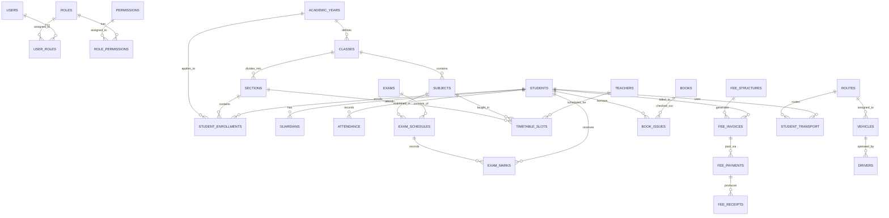

# Database Design Document: Enterprise School Management ERP
**Database Engine:** PostgreSQL 15+ / 16  
**Architecture:** Normalized 3NF / BCNF with Strategic Denormalization for Financial Audit Trails  
**Schema Standard:** UUID v4 Primary Keys, Strict Foreign Key Cascades, Index Optimization, Flyway Version Control  

---

## 1. Entity-Relationship (ER) Diagram

---

## 2. Relational Schema Architecture

The database is divided into logical domain areas:
1. **Core & Identity**: `users`, `roles`, `permissions`, `user_roles`, `role_permissions`, `audit_logs`, `school_profile`.
2. **Academic Structure**: `academic_years`, `classes`, `sections`, `subjects`, `teacher_subjects`, `timetable_slots`.
3. **Student Lifecycle**: `students`, `guardians`, `student_enrollments`, `student_documents`.
4. **Staff & Human Resources**: `staff`, `teachers`, `departments`, `designations`, `staff_leaves`, `payroll_records`.
5. **Attendance Engine**: `student_attendance`, `staff_attendance`.
6. **Examination & Assessment**: `exams`, `grade_scales`, `exam_schedules`, `exam_marks`, `report_cards`.
7. **Fee & Financial Governance**: `fee_categories`, `fee_structures`, `fee_invoices`, `fee_discounts`, `fee_payments`, `fee_receipts`, `expenses`, `income_ledger`.
8. **Operations & Facilities**: `books`, `book_categories`, `book_issues`, `routes`, `vehicles`, `drivers`, `student_transport`, `hostel_rooms`, `inventory_items`.
