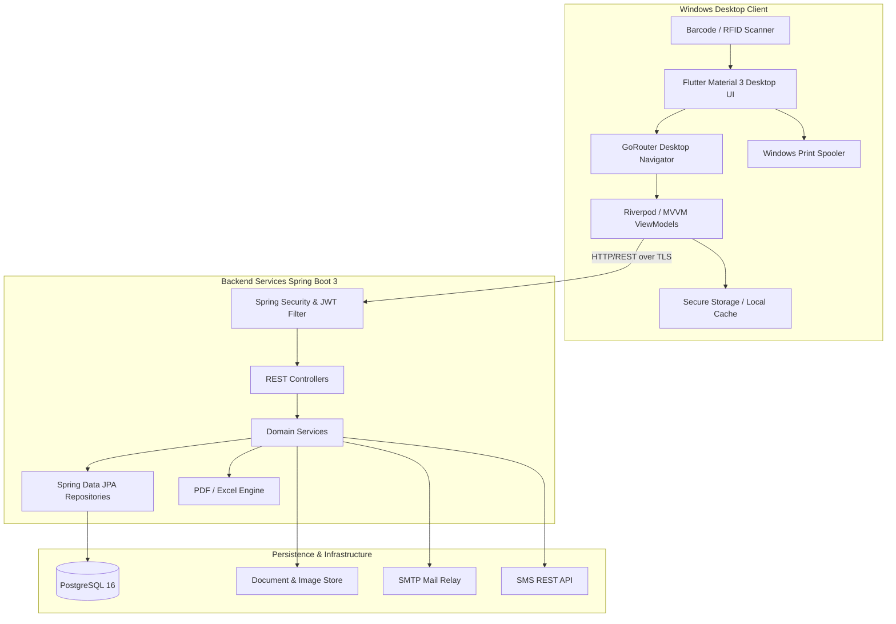

# Software Requirement Specification (SRS)
## Enterprise School Management System (Desktop ERP)
**Standard:** IEEE 830-1998 Compliant  
**Version:** 1.0.0  
**Status:** Approved for Implementation  

---

### 1. Introduction
#### 1.1 Purpose
This Software Requirement Specification (SRS) defines the functional, behavioral, interface, and performance specifications for the **Enterprise School Management System (Desktop ERP)**. The system provides institutional workflow automation for academic governance, financial ledgering, student lifecycle tracking, examinations, and facilities management.

#### 1.2 Scope of the System
The system comprises two core components:
1. **Desktop Client**: A high-performance Flutter desktop application for Windows, featuring Material 3 UI, multi-tab and split-pane desktop navigation, local caching, vector PDF document generation, and direct thermal/A4 printer spooling.
2. **Backend Services**: A high-throughput Spring Boot 3 RESTful micro-monolith running on Java 21, coupled with a PostgreSQL database, Spring Security 6 with stateless JWT authentication, RBAC authorization, and automated database migrations using Flyway.

#### 1.3 Definitions, Acronyms, and Abbreviations
- **ERP**: Enterprise Resource Planning
- **RBAC**: Role-Based Access Control
- **JWT**: JSON Web Token
- **POS / Thermal**: Point-of-Sale 80mm receipt printing
- **GPA / CGPA**: Grade Point Average / Cumulative Grade Point Average
- **TC**: Transfer Certificate
- **ACID**: Atomicity, Consistency, Isolation, Durability

---

### 2. Overall System Description
#### 2.1 Product Perspective & System Context
The desktop client acts as the administrative terminal, interfacing over HTTPS/TLS 1.3 with the Spring Boot backend service. The backend interacts directly with PostgreSQL, local/network file storage for uploads, and notification relays (SMTP for Email, REST Gateway for SMS).



---

### 3. Detailed Use Case Specifications

#### 3.1 Use Case UC-01: Authentication & Token Rotation
- **Actors**: All 11 Roles (Super Admin to Transport Manager).
- **Preconditions**: User account is active and not locked.
- **Normal Flow**:
  1. User inputs username/email and password on the Flutter Desktop login screen.
  2. Client submits credentials via `POST /api/v1/auth/login`.
  3. Spring Security validates credentials via `DaoAuthenticationProvider` with BCrypt.
  4. Backend generates an `accessToken` (15-minute expiry) and a cryptographically secure `refreshToken` (7-day expiry).
  5. Response returns token payload, user profile, active academic session ID, and authorized permission list.
  6. Client saves tokens securely in desktop secure storage.
- **Token Rotation Flow**:
  1. On HTTP 401 response from any protected API, client interceptor locks outgoing requests.
  2. Client calls `POST /api/v1/auth/refresh-token` with the refresh token.
  3. Backend verifies refresh token, revokes the old token, and issues a new pair.
  4. Client resumes pending requests transparently without logging out the user.

#### 3.2 Use Case UC-02: Fee Invoicing, Collection & Thermal Receipt Printing
- **Actors**: Accountant, Super Admin, Admin.
- **Preconditions**: Student is enrolled; fee structure is configured for the active academic session.
- **Normal Flow**:
  1. Accountant selects a student via barcode scan or student search.
  2. System displays unpaid dues, itemized fee breakdown (Tuition, Transport, Lab, Exam), and accrued late fines.
  3. Accountant selects fee items to collect, enters payment mode (Cash, Card, Bank Transfer, Online).
  4. Accountant applies an authorized discount code if eligible.
  5. Accountant clicks "Collect & Print".
  6. Backend initiates an ACID transaction: creates `FeeTransaction`, updates `StudentFeeBalance`, logs audit trail.
  7. Backend returns transaction payload with receipt number and cryptographic checksum.
  8. Desktop client spools an 80mm thermal receipt or A4 invoice to the default Windows printer.

#### 3.3 Use Case UC-03: Batch Attendance Recording
- **Actors**: Teacher, Class Teacher, Vice Principal.
- **Preconditions**: Active academic term; teacher assigned to the selected Class and Section.
- **Normal Flow**:
  1. Teacher selects Class (e.g., Grade 10) and Section (e.g., Section A).
  2. System loads student roster with default status set to "Present".
  3. Teacher toggles students who are "Absent", "Late", or "Excused" with optional remarks.
  4. Teacher submits attendance.
  5. System validates that attendance for that class/section/date is not already locked.
  6. System saves records and triggers automated SMS/Push notification alerts to parents of absent students.

#### 3.4 Use Case UC-04: Examination Marks Entry & Report Card Generation
- **Actors**: Teacher, Exam Controller, Principal.
- **Preconditions**: Exam created with scheduled subjects, maximum marks, and passing criteria.
- **Normal Flow**:
  1. Teacher selects Exam (e.g., Mid-Term 2025), Class, Section, and Subject (e.g., Mathematics).
  2. Grid presents list of students with input fields for Theory, Practical, and Internal Assessment marks.
  3. Real-time validation checks that entered mark $\le$ maximum mark.
  4. Teacher saves marks draft or submits for final verification.
  5. Exam Controller reviews and "Locks/Publishes" marks.
  6. System calculates Total Marks, Percentage, Grade, GPA, and Class Rank.
  7. Client allows bulk generation and export of official PDF Report Cards featuring school logo, student photo, grade scale, and digital signature lines.

---

### 4. API Contract Specifications (OpenAPI 3.0 Sample Excerpt)

#### 4.1 Authentication Endpoints
- `POST /api/v1/auth/login`
  - Request: `{"username": "admin@school.edu", "password": "Password@123", "rememberMe": true}`
  - Response (200 OK):
    ```json
    {
      "success": true,
      "message": "Authentication successful",
      "data": {
        "accessToken": "eyJhbGciOi...",
        "refreshToken": "dGhpcy1pcy1h...",
        "tokenType": "Bearer",
        "expiresIn": 900,
        "user": {
          "id": "uuid-v4",
          "username": "admin@school.edu",
          "fullName": "System Administrator",
          "role": "ROLE_SUPER_ADMIN",
          "permissions": ["STUDENT_READ", "STUDENT_CREATE", "FEE_COLLECT", "SYSTEM_SETTINGS"]
        },
        "activeAcademicYear": {
          "id": "year-uuid",
          "name": "2025-2026",
          "isCurrent": true
        }
      }
    }
    ```

- `POST /api/v1/auth/refresh-token`
  - Request: `{"refreshToken": "dGhpcy1pcy1h..."}`
  - Response (200 OK): New access token and rotated refresh token.

#### 4.2 Student Lifecycle Endpoints
- `GET /api/v1/students?page=0&size=20&sort=rollNumber,asc&classId=uuid&search=John`
  - Response (200 OK): Paginated student DTO list with total elements, page count, and metadata.
- `POST /api/v1/students`
  - Request: Complete student admission payload (Personal, Guardian, Medical, Academic).
  - Response (201 Created): Created student entity with generated `admissionNumber`.

#### 4.3 Fee Management Endpoints
- `GET /api/v1/fees/students/{studentId}/dues`
  - Response (200 OK): Detailed breakdown of pending invoices, categories, fines, and historical ledger.
- `POST /api/v1/fees/collect`
  - Request: Invoice ID list, amounts paid, payment mode, receipt remarks.
  - Response (201 Created): Receipt summary with printable receipt metadata.
